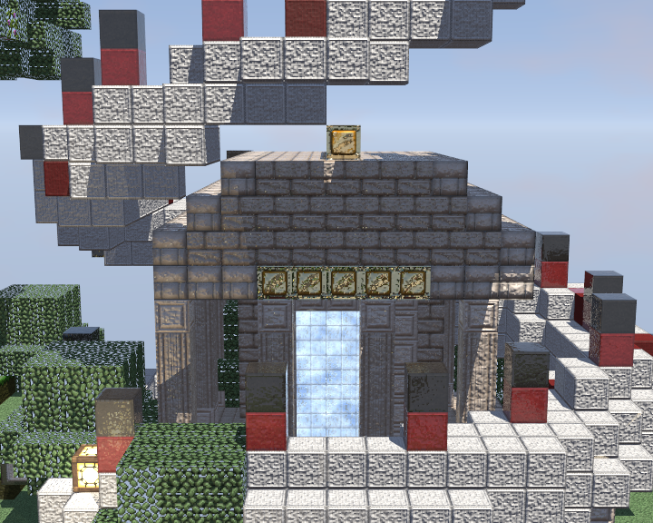
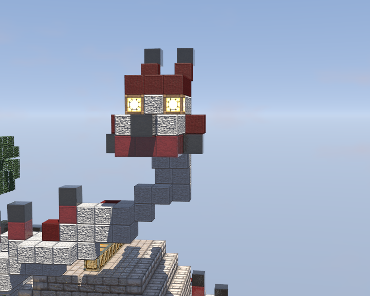
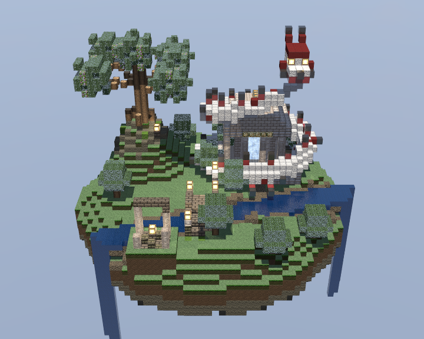
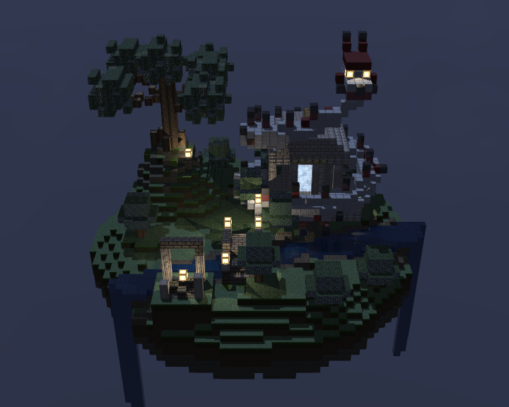

# Skyblock Diorama — CPU Raytracer

Diorama de isla flotante estilo Minecraft, renderizado con un raytracer escrito desde
cero en Rust. **Todo el cómputo corre en CPU**: sin OpenGL, sin shaders, sin GPU.





Ciclo de día y noche — la misma escena a mediodía y a medianoche:




La única dependencia externa es `minifb`, y sirve exclusivamente para mostrar en una
ventana el buffer que la CPU ya calculó (en Linux hace `XPutImage`, una copia de
píxeles; no crea contexto 3D). El motor también corre sin ventana con `--render`.

Escrito a mano, sin crates: matemática vectorial, decodificador y codificador PNG
(incluye DEFLATE completo), lector del ZIP del texture pack, ruido Perlin/fBm,
recorrido DDA de vóxeles, mapas normales, skybox, y el planificador multihilo.

## Uso

```bash
cargo run --release                              # ventana interactiva
cargo run --release -- --render out/ -n 240 --samples 8   # órbita a PNGs, sin ventana
cargo run --release -- --bench 30                # medición de ms/frame
cargo run --release -- --bench-idle 60           # medición del frame en reposo
cargo run --release -- --bench-move 60           # medición del frame mientras se arrastra
cargo run --release -- --check-pack              # verifica la carga del texture pack
cargo test --release                             # 112 pruebas
```

Opciones: `--width W --height H --seed N --threads N --samples N --sky-panorama
--time T --cycle --eye X,Y,Z --look YAW,PITCH`.

`--eye` y `--look` plantan la cámara libre en un punto concreto para el render
offline, útil para capturas desde dentro de la escena o desde debajo de la isla.

`--time T` fija la hora (`0` amanecer, `0.25` mediodía, `0.5` atardecer, `0.75`
medianoche) y `--cycle` barre un día completo a lo largo de los frames de `--render`,
que es como se arma el video del ciclo.

### Controles

| Tecla / acción | Efecto |
|---|---|
| Flechas, arrastrar mouse | Girar la cámara |
| `W` / `S` | Acercar-alejar (órbita) · avanzar-retroceder (vuelo) |
| `A` / `D` | Girar alrededor de la isla (órbita) · desplazarse a los lados (vuelo) |
| `Q` / `E` | Bajar / subir (vuelo) |
| `Shift` | Moverse más rápido |
| Scroll | Acercar / alejar |
| `F` | Alternar entre **órbita** y **vuelo libre** |
| `Espacio` | Arrancar / detener el **ciclo de día y noche** |
| `,` / `.` | Mover la hora a mano |
| `R` | Regenerar el terreno con otra semilla |
| `1`–`4` | Escala de resolución |
| `P` | Captura de pantalla a PNG |
| `Esc` | Salir |

Mientras la cámara se mueve se traza **medio frame en tablero de ajedrez a resolución
completa** y el resto conserva el color anterior: mismo costo que media resolución, sin
los bordes escalonados. Al soltarla se **acumulan muestras jittereadas** hasta
converger, que es de donde sale el antialiasing; ya convergida solo se re-trazan los
píxeles que siguen cambiando —el agua, el portal y sus reflejos—.

## Texture pack

La escena usa **Ozocraft Remix** (32×32). El pack no se incluye en el repositorio por
tamaño y licencia. Para ejecutarlo, colocar el `.zip` del pack en:

```
texturepack/Ozocraft Remix 1.21+ [R17].zip
```

El programa lee las texturas directamente del ZIP con su propio DEFLATE.

## Qué implementa

| Elemento | Dónde |
|---|---|
| Terreno procedural 48×48 (supera el mínimo de 16×16) | `terrain.rs` — Perlin/fBm propio, isla con estalactita, montículo rocoso, río con dos cascadas, vetas de mineral, árboles |
| Complejidad de escena | `structures.rs` — templo, dragón enrollado, gran árbol, puente, ruina |
| Rotación y zoom de cámara | `camera.rs` — órbita con pitch acotado y zoom multiplicativo, más vuelo libre con `F` |
| 5 materiales con textura y parámetros propios | `assets.rs` — terreno, agua, metal, emisivo, cristal |
| Refracción | `render.rs` — Snell con reflexión interna total; agua y puerta de cristal |
| Reflexión | `render.rs` — Fresnel de Schlick; oro, hierro, diamante, agua |
| Mapas normales | `texture.rs` — derivados por Sobel de la luminancia de cada textura |
| Material emisivo | glowstone y la puerta, como luces puntuales reales |
| Skybox | `skybox.rs` — cielo procedural que sigue la hora (por defecto) o cubemap del panorama |
| Ciclo día/noche | `daylight.rs` — sol, luna, paleta del cielo y ambiente desde un solo número; tecla `Espacio` |
| Paralelismo y optimización | `parallel.rs`, tabla de mediciones abajo |

## La escena

Siguiendo el diorama de referencia: isla flotante con un **templo de columnas** y su
puerta de cristal iluminada, un **dragón blanco y rojo enrollado alrededor del
templo** —lana blanca, cresta de lana y concreto rojo, espinas negras, garganta de
netherrack y ojos de glowstone— que da vuelta y media a la columnata y saca la
cabeza por encima de la cumbrera, un **gran árbol** sobre un afloramiento rocoso, un **río**
que cruza la isla y cae por los dos bordes, un **puente de piedra** con linternas, y
una **ruina** de columnas rotas en primer plano. Debajo, vetas de oro, hierro y
diamante que solo se ven al orbitar por abajo.

## Rendimiento

Escena completa (isla 48×48), 900×600, CPU de 8 núcleos / 16 hilos:

| Hilos | ms/frame | fps | Aceleración |
|---|---|---|---|
| 1 | 239.85 | 4.2 | 1.00× |
| 4 | 63.92 | 15.6 | 3.75× |
| 16 | 27.03 | 37.0 | **8.55×** |

Optimizaciones aplicadas, cada una medida a 640×520 con 16 hilos:

| Cambio | ms/frame |
|---|---|
| Cielo analítico evaluado por rayo | 98.86 |
| Cielo horneado en tabla lat-long | 9.84 |
| *(escena completa: recursión + luces)* | 92.94 |
| Omitir el rayo de sombra en caras que no ven el sol | 18.01 |
| Agrupar bloques emisivos vecinos en una sola luz | 17.89 |
| Descartar linternas cuya contribución es despreciable | 17.12 |
| Seguir solo la rama dominante tras la primera división | **13.52** |

El ciclo de día y noche cuesta **~4.5 ms cada vez que rehornea el cielo** (medido con
`--bench N --cycle`, que fuerza un rehorneado por frame: 18.49 → 23.0 ms). En la
ventana el cielo solo se rehornea al cruzar uno de los 96 pasos del día, así que con
un día de 30 s son ~3 rehorneados por segundo: cerca del 1.5% del tiempo de frame.

Los dos caminos interactivos cuestan bastante menos que un frame completo:

| Camino (900×600, 16 hilos) | ms/frame | píxeles trazados |
|---|---|---|
| Frame completo | 24.1 | 100% |
| Arrastrando (tablero) | **14.6** (69 fps) | 50% |
| En reposo (refresco selectivo) | **16.0** | 49% |

Un cambio de hora no reinicia nada: marca todos los píxeles como activos y re-sombrea
a resolución plena sobre la imagen que ya había, así el ciclo se ve como un fundido.

Reproducible con `--bench N` y `--bench-idle N`, más `--width W --height H
--threads N [--cycle]`.

## Estructura

```
src/
  main.rs        modos: ventana, render offline, benchmark, verificación del pack
  output.rs      trait Output: ventana o PNGs; el renderer no sabe cuál
  window.rs      único módulo que toca minifb
  math.rs        Vec3, reflect, refract (Snell + TIR), Fresnel, gamma
  inflate.rs     DEFLATE (stored, Huffman fijo y dinámico) + zlib
  png.rs         encoder y decoder PNG propios
  zip.rs         lector del texture pack
  texture.rs     texturas en luz lineal, animación y normales por Sobel
  pack.rs        acceso al pack
  blocks.rs      ids de bloque
  material.rs    parámetros ópticos por material
  assets.rs      bloque → textura por cara → material
  noise.rs       Perlin 2D/3D y fBm
  daylight.rs    ciclo día/noche: sol, luna, paletas de cielo y ambiente
  terrain.rs     generación procedural de la isla, el montículo y el río
  structures.rs  templo, dragón, gran árbol, puente, ruina y las luces
  world.rs       grid de vóxeles + DDA
  camera.rs      cámara orbital
  skybox.rs      cielo procedural y cubemap
  scene.rs       mundo + assets + iluminación + reloj de animación
  parallel.rs    reparto dinámico de trabajo entre hilos
  render.rs      sombreado, recursión y pipeline de frame
```
