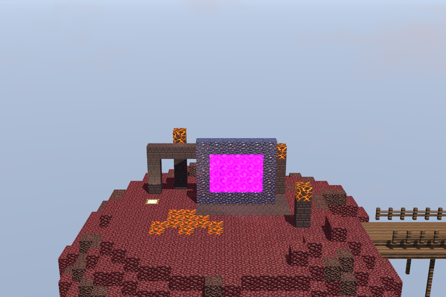
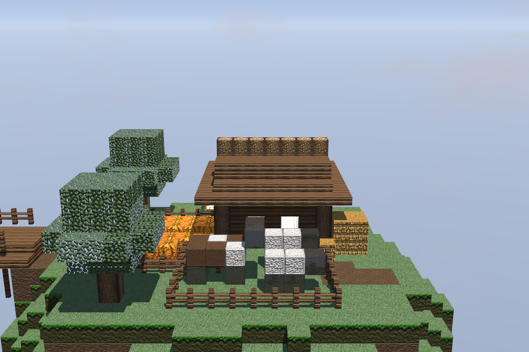
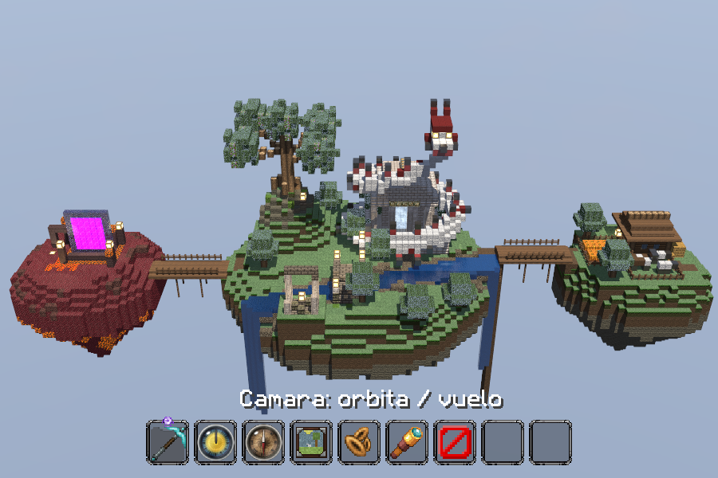

# Skyblock Diorama — CPU Raytracer

Diorama de tres islas flotantes estilo Minecraft, renderizado con un raytracer escrito
desde cero en Rust. **Todo el cómputo corre en CPU**: sin OpenGL, sin shaders, sin GPU.


Las dos islas vecinas, unidas a la principal por puentes de madera con barandas:




La hotbar de Minecraft hace de menú: se elige la ranura con los números y se usa
con `Enter`. Con `E` se abre un inventario de 32 bloques; el elegido va a la última
ranura y se pone en el mundo con click derecho, mientras el izquierdo quita el
bloque que haya bajo el puntero.



Ciclo de día y noche — la misma escena a mediodía y a medianoche:


La única dependencia externa es `minifb`, y sirve exclusivamente para mostrar en una
ventana el buffer que la CPU ya calculó (en Linux hace `XPutImage`, una copia de
píxeles; no crea contexto 3D). El motor también corre sin ventana con `--render`.

Escrito a mano, sin crates: matemática vectorial, decodificador y codificador PNG
(incluye DEFLATE completo), lector del ZIP del texture pack, ruido Perlin/fBm,
recorrido DDA de vóxeles, mapas normales, skybox, y el planificador multihilo.

## Pantalla de inicio

Al abrir la ventana aparece una pantalla de título —fondo, créditos y dos botones,
**Jugar** y **Reglas**— dibujada con la misma tipografía del pack y el mismo
compositor a mano que la interfaz del juego.

Los botones responden al mouse: el que está bajo el puntero se aclara, y al hacer
click la cara se hunde un píxel y se oscurece durante siete frames **antes** de que
la acción ocurra, así el click se ve además de funcionar. Los dos están siempre en el
mismo sitio: antes subían al abrir las reglas, y un botón que se mueve de debajo del
puntero es un botón que se falla.

La escena no se construye hasta que se presiona Jugar, y como eso tarda cerca de un
segundo —terreno, estructuras, las dos islas vecinas y 92 texturas decodificadas—
se arma en un hilo aparte mientras la ventana sigue dibujando la pantalla de carga
con un **spinner** de ocho cuadros girando. Una ventana que deja de responder un
segundo se lee como una ventana que se colgó.

## Uso

```bash
cargo run --release                              # ventana interactiva
cargo run --release -- --render out/ -n 240 --samples 8   # órbita a PNGs, sin ventana
cargo run --release -- --bench 30                # medición de ms/frame
cargo run --release -- --bench-idle 60           # medición del frame en reposo
cargo run --release -- --bench-move 60           # medición del frame mientras se arrastra
cargo run --release -- --check-pack              # verifica la carga del texture pack
cargo test --release                             # 149 pruebas
```

Opciones: `--width W --height H --seed N --threads N --samples N --sky-panorama
--time T --cycle --eye X,Y,Z --look YAW,PITCH --hud`.

`--eye` y `--look` plantan la cámara libre en un punto concreto para el render
offline, útil para capturas desde dentro de la escena o desde debajo de la isla.

`--time T` fija la hora (`0` amanecer, `0.25` mediodía, `0.5` atardecer, `0.75`
medianoche) y `--cycle` barre un día completo a lo largo de los frames de `--render`,
que es como se arma el video del ciclo.

### Controles

| Tecla / acción | Efecto |
|---|---|
| Mover el mouse | Girar la cámara: el **mouselook** está activo desde el primer frame |
| `Tab` | Soltar o retomar el mouselook |
| Arrastrar mouse | Girar la cámara arrastrando la escena, con mouselook apagado |
| Flechas | Girar la cámara (arriba mira hacia arriba) |
| `W` / `S` | Acercar-alejar (órbita) · avanzar-retroceder (vuelo) |
| `A` / `D` | Girar alrededor de la isla (órbita) · desplazarse a los lados (vuelo) |
| `Espacio` / `Shift` | Subir / bajar (vuelo) |
| `Ctrl` | Moverse más rápido |
| Scroll | Acercar / alejar |
| `1`–`8` | Elegir ranura de la hotbar |
| `Enter` | Usar el objeto elegido (mantener, en el reloj y la brújula) |
| `Q` | Arrancar / detener el **ciclo de día y noche** |
| `E` | Abrir / cerrar el **inventario** |
| Click izquierdo | Quitar el bloque apuntado (la cruz, o el puntero sin mouselook) |
| Click derecho | Poner el bloque elegido contra la cara apuntada |
| `F` | Alternar entre **órbita** y **vuelo libre** |
| `H` | Mostrar u ocultar la hotbar |
| `,` / `.` | Mover la hora a mano |
| `R` | Regenerar el terreno con otra semilla |
| `F1`–`F4` | Escala de resolución directa (el telescopio la cicla) |
| `P` | Captura de pantalla a PNG |
| `Esc` | Cierra el inventario; luego suelta el mouse; luego sale |

La hotbar es el menú, y cada objeto es su acción:

| Ranura | Objeto | Qué hace |
|---|---|---|
| 1 | Pico de diamante | Cambia entre órbita y vuelo libre |
| 2 | Reloj | Mantener `Enter`: adelanta la hora (la esfera sigue al sol) |
| 3 | Brújula | Mantener `Enter`: regresa la hora (la aguja sigue a la cámara) |
| 4 | Cuadro | Guarda una captura PNG |
| 5 | Semillas | Genera otro terreno |
| 6 | Telescopio | Sube la escala de resolución: 1 → 2 → 3 → 4 → 1 |
| 7 | Barrera | Salir |
| 8 | Bloque | El que se eligió en el inventario (`E`); click derecho lo pone |

Mientras la cámara se mueve se traza **medio frame en tablero de ajedrez a resolución
completa** y la otra mitad se **interpola de sus dos vecinos de ese mismo frame**:
mismo costo que media resolución, sin bordes escalonados y sin arrastre —conservar el
píxel del frame anterior se veía como desenfoque de movimiento—. Si aun así un frame
pasa de 45 ms (una ventana grande), el arrastre baja a media resolución hasta que la
cámara se detiene. Al soltarla se **acumulan muestras jittereadas** hasta
converger, que es de donde sale el antialiasing; ya convergida solo se re-trazan los
píxeles que siguen cambiando —el agua, el portal y sus reflejos—.

## Texturas

Las **92 texturas que el programa realmente usa** están en `textures/`, con la misma
estructura que el pack menos el prefijo `assets/minecraft/textures/`:

```
textures/block/…   45 bloques
textures/item/…    reloj (16 fotogramas), brújula (8), pico, cuadro, semillas,
                   telescopio, barrera
textures/gui/…     hotbar, selección, cruz, y las seis caras del panorama
textures/font/…    ascii.png, la tipografía del HUD
```

Con eso el repositorio se clona y se ejecuta **sin descargar nada**. El programa
prefiere esa carpeta; si no está, busca el `.zip` del pack en `texturepack/` y lo lee
directo con su propio inflate:

```
texturepack/Ozocraft Remix 1.21+ [R17].zip
```

Las texturas son de **Ozocraft Remix** (32×32) y se incluyen solo las necesarias para
reproducir este trabajo académico; el pack completo (51 MB) sigue fuera del
repositorio.

## Qué implementa

| Elemento | Dónde |
|---|---|
| Terreno procedural 48×48 (supera el mínimo de 16×16) | `terrain.rs` — Perlin/fBm propio, isla con estalactita, montículo rocoso, río con dos cascadas, vetas de mineral, árboles |
| Dos islas vecinas y sus puentes | `neighbours.rs` — mismo ruido a menor escala, isla del Nether e isla granja |
| Complejidad de escena | `structures.rs` — templo, dragón enrollado, gran árbol, puente, ruina |
| Bloques parciales (slabs, cercas, cultivos) | `world.rs` — cajas dentro del vóxel resueltas dentro del propio DDA |
| Rotación y zoom de cámara | `camera.rs` — órbita con pitch acotado y zoom multiplicativo, más vuelo libre con `F` |
| 5 materiales con textura y parámetros propios | `assets.rs` — terreno, agua, metal, emisivo, cristal |
| Refracción | `render.rs` — Snell con reflexión interna total; agua y puerta de cristal |
| Reflexión | `render.rs` — Fresnel de Schlick; oro, hierro, diamante, agua |
| Mapas normales | `texture.rs` — derivados por Sobel de la luminancia de cada textura |
| Material emisivo | glowstone y la puerta, como luces puntuales reales |
| Skybox | `skybox.rs` — cielo procedural que sigue la hora (por defecto) o cubemap del panorama |
| Ciclo día/noche | `daylight.rs` — sol, luna, paleta del cielo y ambiente desde un solo número; tecla `Q` |
| Paralelismo y optimización | `parallel.rs`, tabla de mediciones abajo |

## Arquitectura

El proyecto está escrito en capas con dependencias en una sola dirección: nada de lo
que está abajo sabe de lo que está arriba.

```
  main.rs ──► ui/ ──► window.rs ──► minifb     (única dependencia externa)
     │               splash.rs, hud.rs         (interfaz compuesta a mano)
     ▼
  render/ ──► mod.rs, parallel.rs, output.rs
     │
     └──► scene/ ──┬──► world.rs   ◄── worldgen/ terrain.rs ─┐
                   │                             structures.rs├──► noise.rs
                   │                             neighbours.rs┘
                   ├──► camera.rs
                   ├──► skybox.rs, daylight.rs
                   │
                   └──► assets/ ──┬──► texture.rs, material.rs, blocks.rs
                                  └──► pack.rs ──► codec/ zip.rs, png.rs,
                                                          inflate.rs

  transversal: math.rs (Vec3, Fresnel, Snell)
```

Las tres piezas centrales:

- **`world.rs`** es la única representación de la escena: una cuadrícula densa de
  128×60×64 celdas, un byte por celda con el id del bloque (490 k celdas, 490 KB). No sabe qué es un templo ni un dragón.
  Expone una sola operación, `trace(ray, max_t, accept) -> Option<Hit>`; **todo** lo
  demás —cámara, sombras, reflexiones, refracciones, y hasta el click del mouse—
  consume solo eso.
- **`scene.rs`** junta el mundo con los materiales, la iluminación del momento y el
  reloj de animación. Es lo que `render.rs` recibe: un objeto inmutable durante el
  frame, que por eso se puede compartir entre todos los hilos sin candados.
- **`render.rs`** no sabe a dónde va la imagen. Escribe en un `Framebuffer` y quien
  lo presenta es un `Output`: la ventana o un PNG. Por eso el mismo motor entrega el
  render offline sin abrir ventana.

La generación también está en capas: `terrain.rs` construye la isla principal en su
propia caja de 48×48, `structures.rs` le pone los edificios en esas mismas
coordenadas, y `neighbours.rs` estampa el resultado en el mundo grande y hace crecer
las dos islas vecinas alrededor. Ninguna de las dos primeras sabe que existe un mundo
más ancho.

## Cómo se traza un rayo

### El rayo de la cámara

Un rayo por píxel, generado a partir de la base ortonormal de la cámara:

```rust
let half_h = (fov_y * 0.5).tan();
let half_w = half_h * aspect;
let sx =  ((x + jitter.0) / width  * 2.0 - 1.0) * half_w;
let sy = -((y + jitter.1) / height * 2.0 - 1.0) * half_h;   // y de pantalla crece hacia abajo
Ray::new(eye, forward + right * sx + up * sy)
```

El `jitter` es lo que convierte el mismo código en antialiasing: con `(0.5, 0.5)` el
rayo pasa por el centro del píxel; con un desplazamiento distinto cada frame, el
promedio de varios frames es una imagen suavizada.

### El recorrido: DDA sobre la cuadrícula

Como toda la escena son cubos alineados a una cuadrícula entera, no hace falta un
BVH ni probar intersecciones contra triángulos. Se usa el **DDA 3D de
Amanatides–Woo**: el rayo camina de celda en celda, y cada paso cuesta una
comparación y dos sumas.

1. **Entrada**: se corta el rayo contra la caja del mundo (`box_range`) para saber
   entre qué distancias vale la pena caminar. Si no la toca, es cielo.
2. **Preparación**: por cada eje se calcula `step` (±1), `t_max` (distancia hasta el
   próximo borde de celda) y `t_delta` (distancia entre bordes, `1/|dir|`).
3. **Paso**: se avanza por el eje cuyo `t_max` es menor, se actualizan `voxel` y
   `t_max`, y la cara golpeada sale del eje y el signo del paso —sin calcular
   intersecciones.

```rust
let axis = argmin(t_max);          // el borde más cercano
t = t_max[axis];
voxel[axis] += step[axis];
t_max[axis] += t_delta[axis];
face = Face::from_axis(axis, step[axis] > 0);
```

Sobre eso, dos cosas:

- **Macro-cuadrícula de ocupación** de 4×4×4: un booleano por macro-celda que dice
  si contiene algo. Evita leer el arreglo de bloques en el aire, que es la mayor parte
  del mundo. *(Saltar la macro-celda entera en vez de recorrerla se implementó dos
  veces y se midió más lento las dos; está documentado abajo.)*
- **Bloques parciales**. Slabs y cercas no llenan su celda. Cuando el DDA entra en
  una de ellas, resuelve un test rayo/caja **dentro** de la celda, entre la `t` de
  entrada y la de salida; si falla, el rayo sencillamente sigue. Las cercas arman sus
  cajas al vuelo —poste central más travesaños hacia cada vecino sólido—, que es lo
  que hace que una fila se lea como baranda.

El resultado es un `Hit { t, block, face, normal, u, v, voxel, point }`. Las `u, v`
salen de la parte fraccionaria del punto sobre la cara, así que texturar es una
resta y una multiplicación.

### Un solo trazador para todo

`trace` recibe un predicado `accept`, y eso basta para servir a todos los tipos de
rayo sin duplicar el recorrido:

| Rayo | Predicado | Para qué |
|---|---|---|
| Cámara / reflexión / refracción | acepta todo | primer bloque visible |
| Sombra del sol | no-aire, hasta 56 bloques | ¿llega el sol a este punto? |
| Sombra de una linterna | no-aire **y** opaco, hasta la luz | el vidrio no tapa una lámpara |
| Click del mouse | no-aire | qué bloque quitar, y contra qué cara poner uno |

Encima del recorrido va un **salto de texels transparentes** (`first_visible_hit`):
si el téxel golpeado tiene alfa < 0.5 —el interior de un vidrio, los huecos de una
hoja— el rayo continúa **fuera de esa celda**, hasta seis veces. Adelantarlo solo un
épsilon lo dejaba dentro del mismo vóxel, así que el siguiente recorrido volvía a
golpear el mismo bloque: una ventana se gastaba sus seis saltos contra sí misma y el
rayo terminaba devolviendo cielo. Era el bug que hacía que por las ventanas se viera
el cielo en vez del cuarto.

## Cómo se sombrea

### Luz directa

Blinn-Phong con sombras, ambiente hemisférico y emisión propia:

```
color = albedo·luz_sol·(n·l)·sombra                    difuso
      + luz_sol·ks·(n·h)^shininess·sombra              especular (vector medio)
      + albedo·lerp(suelo, cielo, n.y·0.5+0.5)·0.55    ambiente de dos tonos
      + albedo·emisión                                 el bloque brilla solo
      + luces puntuales                                glowstone, lava, portales
```

Detalles que importan:

- **La sombra solo se traza si `n·l > 0`.** Una cara que da la espalda al sol no
  recibe nada del sol, así que ese rayo —que además cruza toda la isla— no cambiaba
  un píxel. Es la optimización que más rindió de todo el proyecto: 92.94 → 18.01 ms.
- **Las sombras son suaves con lo transparente**: el rayo de sombra no se detiene en
  el agua o el vidrio, los atraviesa multiplicando la transmisión.
- **Luces puntuales**: los bloques emisivos se agrupan en clústeres (los 12 bloques de
  la puerta son una sola luz) y por cada punto sombreado se consideran solo las tres
  más cercanas dentro de 15 bloques, descartando por atenuación **antes** de pagar el
  rayo de sombra.
- **Mapas normales**: la normal de la cara se perturba con la normal derivada por
  Sobel de la textura, llevada a mundo con el marco tangente de esa cara concreta.

### Recursión: reflexión y refracción

```
radiance(rayo, profundidad, peso):
    hit = primer_impacto(rayo) o devolver cielo
    directo = luz_directa(hit)
    si profundidad = 4 o peso < 0.015: devolver directo
    si material transparente:  Fresnel divide en reflejado + refractado (Snell)
    si material metálico:      un rayo reflejado, teñido por el metal
    si no:                     directo
```

- **Fresnel de Schlick** decide cuánto se refleja y cuánto se transmite según el
  ángulo: el agua vista de canto es un espejo, vista desde arriba es una ventana.
- **Snell** para la dirección refractada, con **reflexión interna total** cuando no
  existe rayo transmitido (el `refract` devuelve `None` y todo se va por el reflejo).
- **Solo la rama dominante después del primer rebote**: una superficie transparente
  lanza dos rayos, así que el conteo se duplica por nivel. A partir del segundo nivel
  se sigue la rama con más peso y la otra reutiliza su color. Indistinguible a ojo,
  un tercio menos de tiempo (17.12 → 13.52 ms en la medición de la fase 9).
- **Corte por contribución**: cada rayo carga cuánto pesa todavía en el píxel final;
  por debajo de 0.015 se abandona.

## El pipeline del frame

El renderer tiene tres caminos y el bucle de la ventana elige uno por frame:

| Camino | Cuándo | Qué hace |
|---|---|---|
| `render_moving` | la cámara se mueve | tablero de ajedrez: traza la mitad de los píxeles e interpola la otra mitad de sus vecinos de **este** frame |
| `render` | arrastre pesado (>45 ms) | resolución reducida y escalado por vecino más cercano |
| `accumulate` | la cámara está quieta | una muestra jittereada por frame, promediada sobre la anterior |

`accumulate` es donde vive casi toda la calidad:

- El desplazamiento sub-píxel viene de una **secuencia de Halton** (bases 2 y 3), que
  cubre el píxel uniformemente en vez de agruparse como lo haría un aleatorio con
  pocas muestras.
- El promedio es **corrido con piso en 1/16**: los primeros frames convergen (pesos
  1, ½, ⅓…) y después el peso deja de encogerse, así la imagen sigue al agua y al
  portal animados en vez de congelarse. Antes esto se resolvía reiniciando el
  promedio, y eso era el "parpadeo" que se veía cada 16 frames.
- Ya convergida, un píxel que no cambia solo se re-traza **1 de cada 8 frames**: se
  guarda por píxel si su última muestra se movió más de 0.004 en luz lineal. El agua,
  el portal y sus reflejos siguen trazándose siempre; los dos tercios quietos de la
  imagen, no.

Todo el sombreado ocurre en **luz lineal**; la conversión a sRGB (gamma 1/2.2) y el
empaquetado a `0RGB` pasan una sola vez, al escribir el píxel.

## Paralelismo

`std::thread::scope`, sin rayon ni canales:

- La imagen se corta en **tiras de 4 filas** y los hilos toman la siguiente de una
  cola compartida (`AtomicUsize` + `Mutex`), en vez de repartirse el frame en partes
  iguales. Importa porque una tira de cielo vacío cuesta una fracción de una que
  cruza la isla: con reparto fijo, los hilos rápidos esperan al lento.
- Cada tira es un `&mut [u32]` **disjunto** del framebuffer, así que durante el
  sombreado no hay ningún candado: los hilos nunca tocan el mismo píxel.
- La escena es inmutable durante el frame, de modo que se comparte por referencia
  entre todos los hilos sin sincronización.
- El mismo planificador (`process_chunks`) reparte también el horneado de la tabla
  del cielo, que tiene el mismo problema de costo desigual (polos contra ecuador).

Escalado medido sobre la escena de tres islas (900×600, `--bench 20`): 271.71 ms con
un hilo → 33.49 ms con 16, **8.11×** en una CPU de 8 núcleos físicos.

## La escena

Tres islas. La central sigue el diorama de referencia: isla flotante con un **templo de columnas** y su
puerta de cristal iluminada, un **dragón blanco y rojo enrollado alrededor del
templo** —lana blanca, cresta de lana y concreto rojo, espinas negras, garganta de
netherrack y ojos de glowstone— que da vuelta y media a la columnata y saca la
cabeza por encima de la cumbrera, un **gran árbol** sobre un afloramiento rocoso, un **río**
que cruza la isla y cae por los dos bordes, un **puente de piedra** con linternas, y
una **ruina** de columnas rotas en primer plano. Debajo, vetas de oro, hierro y
diamante que solo se ven al orbitar por abajo.

A los lados, dos islas más pequeñas generadas con el mismo ruido, unidas a la
principal por **puentes de madera** con cubierta de tablones, borde de *slabs*,
barandas de cercas y postes colgando al vacío:

- **Isla del Nether** (oeste): netherrack y arena de almas, una poza de **lava**,
  magma brillando por el envés de la isla, un arco roto de ladrillo del Nether y un
  **portal al Nether** de obsidiana, transparente, refractante y encendido.
- **Granja** (este): casa de tablones con esquinas de tronco, ventanas de vidrio y
  techo de *slabs*; un campo de **calabazas** en surcos sobre tierra de labor regada por
  un canal; pilas de **heno**; y un corral de cercas con una vaca y dos ovejas
  construidas con bloques.

## Rendimiento

Escena completa (tres islas, 128×60×64), 900×600, CPU de 8 núcleos / 16 hilos,
medido con `--bench 20`:

| Hilos | ms/frame | fps | Aceleración |
|---|---|---|---|
| 1 | 271.71 | 3.7 | 1.00× |
| 2 | 137.88 | 7.3 | 1.97× |
| 4 | 73.02 | 13.7 | 3.72× |
| 8 | 43.61 | 22.9 | 6.23× |
| 16 | 33.49 | 29.9 | **8.11×** |

Lineal hasta 8 hilos —los núcleos físicos—; de 8 a 16 el salto es menor porque son
hilos lógicos sobre los mismos núcleos.

Optimizaciones aplicadas, cada una medida a 640×520 con 16 hilos sobre la escena de
una isla (antes de que crecieran las vecinas):

| Cambio | ms/frame |
|---|---|
| Cielo analítico evaluado por rayo | 98.86 |
| Cielo horneado en tabla lat-long | 9.84 |
| *(escena completa: recursión + luces)* | 92.94 |
| Omitir el rayo de sombra en caras que no ven el sol | 18.01 |
| Agrupar bloques emisivos vecinos en una sola luz | 17.89 |
| Descartar linternas cuya contribución es despreciable | 17.12 |
| Seguir solo la rama dominante tras la primera división | **13.52** |

### Ideas medidas y descartadas

Tan útiles como las que sí entraron, y por eso están aquí:

| Idea | Resultado | Por qué falló |
|---|---|---|
| Saltar la macro-celda vacía entera (con división por eje) | 29.5 → 33.9 ms | un paso del DDA es una comparación y dos sumas; calcular el salto cuesta más que los cuatro pasos que ahorra |
| Lo mismo sin divisiones (`t_max + k·t_delta`) | 29.5 → **37.6 ms** | además mete una rama en el bucle más caliente del programa |
| Jerarquía de celdas de 8 y 16, y dos niveles | 18.5 → 19.6–23.8 ms | misma razón, con el mundo tres veces más angosto |
| Recortar el rayo contra la caja del contenido | 18.5 → 18.8 ms | y rompía el cálculo de la cara de entrada |
| Rejilla espacial para las luces | sin cambio | con 18 clústeres, el descarte por atenuación ya las quita antes |

Nota de método que costó tiempo dos veces: `cargo test --release` **no** reconstruye
el binario de release. Dos mediciones salieron de un ejecutable viejo y llevaron a
conclusiones falsas, así que desde entonces toda medición va precedida de un
`cargo build --release` explícito.

El ciclo de día y noche cuesta **~4.5 ms cada vez que rehornea el cielo** (medido con
`--bench N --cycle`, que fuerza un rehorneado por frame: 18.49 → 23.0 ms), pero lo caro
no es el cielo sino **la luz**: cada cambio de iluminación re-sombrea todos los píxeles
a resolución plena. Por eso la iluminación avanza en **240 pasos por día** y el día dura
**2 minutos**: son ~2 re-sombreados por segundo, y los otros ~58 frames refinan la
imagen en vez de recalcularla. El reloj sigue corriendo suave entre paso y paso.

Los dos caminos interactivos cuestan bastante menos que un frame completo:

| Camino (900×600, 16 hilos) | ms/frame | píxeles trazados |
|---|---|---|
| Frame completo | 30.9 | 100% |
| Arrastrando (tablero + interpolación) | **17.2** (58 fps) | 50% |
| Arrastrando, si el frame pasa de 45 ms | media resolución | 25% |
| En reposo (refresco selectivo) | **17.7** | 48% |

Un cambio de hora no reinicia nada: marca todos los píxeles como activos y re-sombrea
a resolución plena sobre la imagen que ya había, así el ciclo se ve como un fundido.

Reproducible con `--bench N` y `--bench-idle N`, más `--width W --height H
--threads N [--cycle]`.

## Estructura

Un archivo por pieza, agrupados por función. Las dependencias van en una sola
dirección: `codec` no sabe qué es un bloque, `worldgen` no sabe qué es un rayo, y
`ui` es lo único que sabe que existe una ventana.

```
src/
  main.rs            modos (ventana, render offline, benchmarks), CLI y el bucle
  math.rs            Vec3, reflect, refract (Snell + TIR), Fresnel, gamma

  codec/             formatos de archivo, escritos a mano
    inflate.rs         DEFLATE (stored, Huffman fijo y dinámico) + zlib
    png.rs             encoder y decoder PNG
    zip.rs             lector del .zip del texture pack

  assets/            de qué está hecha una superficie
    mod.rs             tabla bloque → textura por cara → material
    blocks.rs          ids de bloque y su forma (cubo, losa, cerca)
    material.rs        parámetros ópticos: albedo, especular, ior, emisión…
    texture.rs         texturas en luz lineal, animación y normales por Sobel
    pack.rs            acceso a las texturas: carpeta extraída o el .zip

  worldgen/          qué contiene el mundo, antes de trazar un solo rayo
    noise.rs           Perlin 2D/3D y fBm
    terrain.rs         la isla principal: relieve, río, vetas, árboles
    structures.rs      templo, dragón, gran árbol, puente, ruina y las luces
    neighbours.rs      composición: isla del Nether, granja y los puentes

  scene/             lo que el renderer consume
    mod.rs             mundo + assets + iluminación + reloj de animación
    world.rs           grid de vóxeles, formas parciales y el DDA
    camera.rs          órbita y vuelo libre; genera el rayo de cada píxel
    skybox.rs          cielo procedural horneado, y el cubemap del panorama
    daylight.rs        ciclo día/noche: sol, luna, paletas de cielo y ambiente

  render/            de la escena a los píxeles
    mod.rs             sombreado, recursión, refinamiento y pipeline de frame
    parallel.rs        reparto dinámico de tiras entre hilos
    output.rs          Framebuffer y el trait Output: ventana o PNG

  ui/                lo que la persona ve y toca
    window.rs          único módulo que toca minifb
    splash.rs          pantalla de título: fondo, créditos, botones y reglas
    hud.rs             hotbar, inventario, cruz y tipografía del pack
```
